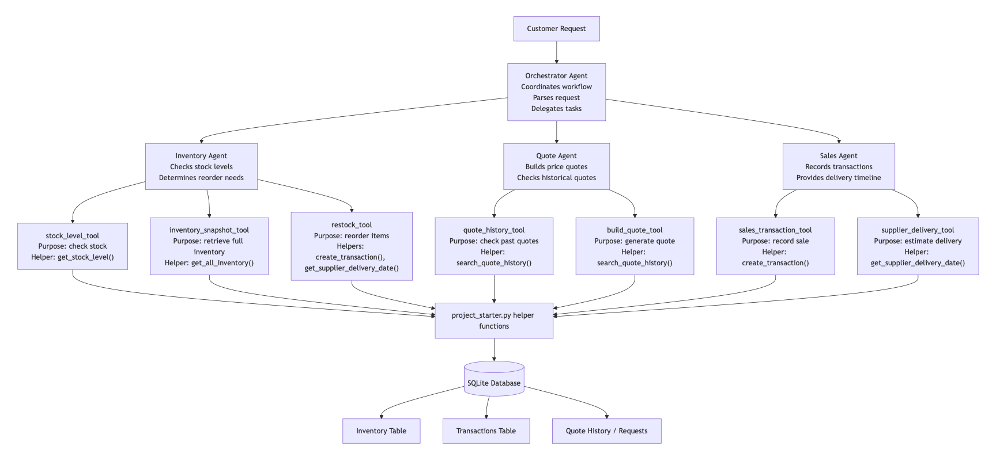

# Agentic AI Inventory & Quoting System (Multi-Agent Architecture)

A multi-agent system for inventory management, pricing, and order fulfillment using tool-based AI agents.

## Highlights

- Multi-agent architecture (Orchestrator + Inventory + Quote + Sales)
- Tool-based reasoning using smolagents
- Real-time inventory and financial tracking
- Automatic reorder decisions when stock is low
- Handles partial fulfillment and unsupported requests

---
## Architecture



---

## System Overview

This project implements a multi-agent inventory, quoting, and sales workflow for a paper supply company. The system uses the **smolagents** framework with tool-based functions while maintaining clear separation between orchestration, inventory, quoting, and sales responsibilities.

The system contains four agents:

### 1. Orchestrator Agent  
Receives customer requests, parses requested items and quantities, delegates work to worker agents, and combines the final customer-facing response.

### 2. Inventory Agent  
Checks stock levels, determines whether an order can be fulfilled immediately, and decides when a reorder is required.

### 3. Quote Agent  
Builds quotes using catalog pricing, bulk discount rules, and historical quote context.

### 4. Sales Agent  
Records sales transactions and returns delivery timeline information.

The agents use tools backed by the helper functions in `project_starter.py`, which interact with the SQLite database.

---

## Workflow Design

The workflow begins when a customer request is received by the Orchestrator Agent. The request is parsed into one or more line items.

For each supported line item:
1. The **Inventory Agent** checks stock availability.
2. If stock is insufficient, a reorder decision is made.
3. The **Quote Agent** calculates pricing and applies rules.
4. The **Sales Agent** records the transaction and provides delivery timelines.

If a requested item is not supported by the company catalog, the system returns a clear customer-facing message explaining that the item is not offered.

---

## Example Output

Poster paper: inventory was insufficient, so a reorder was placed.  
Reorder placed for 600 units of Poster paper.  
Quoted total is $118.75.  
Sale recorded successfully for 500 units.  
Estimated delivery date: 2025-04-07.

---

## Use of Starter Helper Functions

The solution uses the required helper functions from `project_starter.py`, including:

- `create_transaction()`
- `get_all_inventory()`
- `get_stock_level()`
- `get_supplier_delivery_date()`
- `get_cash_balance()`
- `generate_financial_report()`
- `search_quote_history()`

These functions are wrapped as tools and used by the agents.

---

## Evaluation Results

The system was evaluated using `quote_requests_sample.csv`, and the execution generated `test_results.csv`.

The evaluation demonstrates that the system:
- processes multi-item requests,
- fulfills supported requests,
- places reorders when inventory is insufficient,
- records sales transactions,
- changes financial state over time,
- reports unsupported items clearly.

### Concrete examples from `test_results.csv`

- **Request 1** was fully fulfilled across three supported items: Glossy paper, Cardstock, and Colored paper.  
  Cash increased from **$45059.70 → $45124.70**.

- **Request 2** demonstrated partial fulfillment. Poster paper was processed successfully, while unsupported party items were rejected.

- **Request 7** showed multi-item orchestration with reorders across multiple products.

- **Request 15** handled a large-scale order with successful fulfillment and rejection of unsupported items.

- **Request 17** showed mixed fulfillment including paper products and unsupported inventory categories.

These results confirm that the system can both fulfill valid requests and reject unsupported ones with clear explanations.

---

## Strengths

- Clear separation of responsibilities across agents  
- Real-world workflow simulation (inventory → quote → sale)  
- Automatic reorder decision-making  
- Uses database-backed state management  
- Handles multi-item and partial fulfillment scenarios  
- Produces structured evaluation output (`test_results.csv`)

---

## Limitations & Improvements

1. **Rule-based parsing**  
   The request parser is rule-based and may not fully generalize to all natural language inputs.

2. **Catalog understanding**  
   Limited synonym handling for product names.

3. **Business realism**  
   Could be improved with:
   - partial shipments  
   - supplier constraints  
   - payment lifecycle tracking  

---

## How to Run

```bash
pip install -r requirements.txt
python project_starter.py
